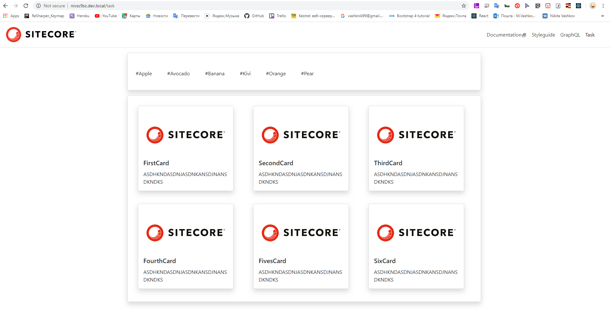

# SitecoreJSS React App #

### Objective: ###
Create a component that contains a list of cards with different tags and do a search using these tags.

### Realization: ###

    1. Create template 'Card' contains fields:
       - Title (field type: Single-Line Text),
       - Content (field type: Multi-Line Text),
       - Tags (field type: Treelist).

    2. Create template 'Tag' contains fields:
       - Tag Name (field type: Single-Line Text).

    3. On sitecore react client scaffolding Components: 
       - 'Tags' (which will be display tags the datasources of all tags you will make on this instanse),
       - 'Cards' (which will be display all cards datasources),
       - 'Pagination' (for pagination).

    4. Sitecore react client need to be setup using 'jss setup' and connected to instance of sitecore(Connected mode).

    5. Create a new project in VS using Helix architecture and make controllers in which use search using Solar index.
 ### Screenshots: ###
 

